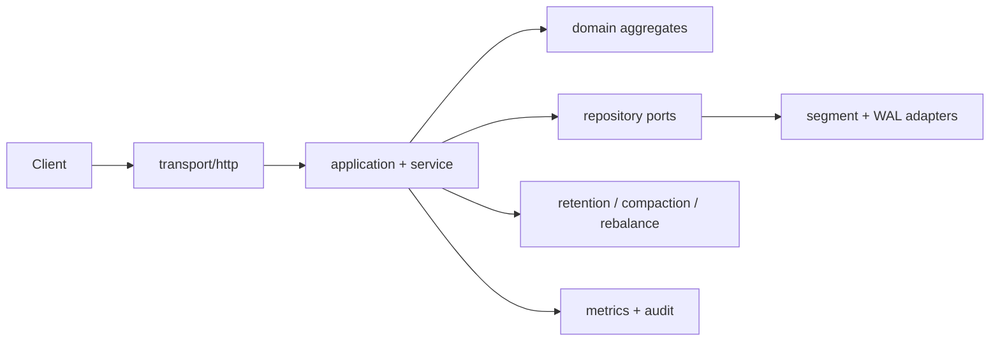

# Persistent Event Stream Broker

多租户、分区化、持久化事件日志服务的纯 Go 参考实现，提供 append-only partition log、幂等 producer sequence、consumer group 租约、offset checkpoint、segment/WAL 恢复、配额背压和可控副本 failover simulator。

## 快速运行

```bash
go run ./cmd/broker
curl http://127.0.0.1:8080/healthz
```

核心 API 包括 `POST|GET /api/v1/tenants`、`POST|GET /api/v1/streams`、`POST /api/v1/topics/{id}/records:append`、`GET /api/v1/topics/{id}/records` 和 consumer group join/heartbeat/pause/resume/offsets。错误使用 `{error:{code,message}}`，offset commit 拒绝回退，append 支持 `Idempotency-Key`。



领域包不依赖 HTTP 或存储。segment 使用 magic、长度和 CRC32 帧，启动时扫描并截断不完整尾部；replication 是 deterministic simulator，包含 epoch fencing、ISR 和 quorum 检查，不冒充真实集群。

## 运维

执行 `go test ./...`、`go test -race ./...`、`go vet ./...`、`go build ./...`。`Dockerfile` 为多阶段构建，`docker-compose.yml` 和 `deployments/kubernetes.yaml` 可用于本地/集群启动，`scripts/smoke.sh` 覆盖健康、租户、stream、append、fetch。`BROKER_DATA_DIR` 默认 `./data`。

威胁模型包含租户隔离、消息大小上限、敏感头脱敏、游标签名和旧 leader 拒写；生产环境应在 ingress 配置 TLS 与认证。备份需包含 segment、manifest、checkpoint，恢复前执行 CRC 扫描。
